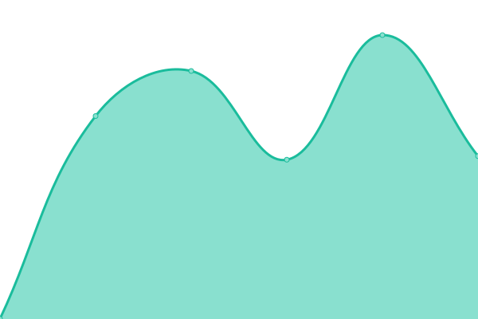
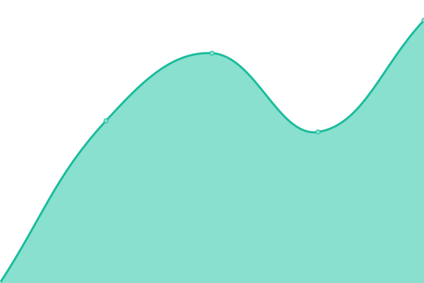
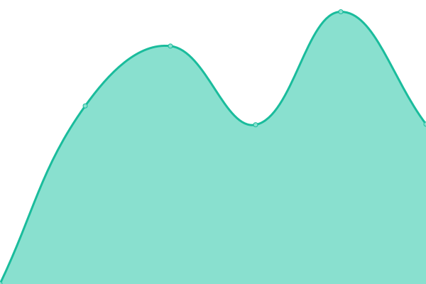

# [📈 Live Status](https://upptime.github.io/upptime): <!--live status--> **🟩 All systems operational**

This repository contains the open-source uptime monitor and status page for [Upptime](https://upptime.js.org), powered by [Upptime](https://github.com/upptime/upptime).

With [Upptime](https://upptime.js.org), you can get your own unlimited and free uptime monitor and status page, powered entirely by a GitHub repository. We use [Issues](https://github.com/upptime/upptime/issues) as incident reports, [Actions](https://github.com/lubosm/minedusk-uptime/actions) as uptime monitors, and [Pages](https://upptime.github.io/upptime) for the status page.

<!--start: status pages-->
<!-- This summary is generated by Upptime (https://github.com/upptime/upptime) -->
<!-- Do not edit this manually, your changes will be overwritten -->
<!-- prettier-ignore -->
| URL | Status | History | Response Time | Uptime |
| --- | ------ | ------- | ------------- | ------ |
|  [minedu.sk](https://www.minedu.sk/) | 🟩 Up | [minedu-sk.yml](https://github.com/lubosm/minedusk-uptime/commits/HEAD/history/minedu-sk.yml) | 

 1020ms
     
 | 

<a href="https://lubosm.github.io/minedusk-uptime/history/minedu-sk">100.00%</a>
    

|  [skolskysport.sk](https://skolskysport.sk/) | 🟩 Up | [skolskysport-sk.yml](https://github.com/lubosm/minedusk-uptime/commits/HEAD/history/skolskysport-sk.yml) | 

 2611ms
     
 | 

<a href="https://lubosm.github.io/minedusk-uptime/history/skolskysport-sk">100.00%</a>
    

|  [vedatechnika.sk](https://www.vedatechnika.sk/) | 🟩 Up | [vedatechnika-sk.yml](https://github.com/lubosm/minedusk-uptime/commits/HEAD/history/vedatechnika-sk.yml) | 

 1919ms
     
 | 

<a href="https://lubosm.github.io/minedusk-uptime/history/vedatechnika-sk">100.00%</a>
    

|  [edicnyportal.iedu.sk](https://edicnyportal.iedu.sk/) | 🟩 Up | [edicnyportal-iedu-sk.yml](https://github.com/lubosm/minedusk-uptime/commits/HEAD/history/edicnyportal-iedu-sk.yml) | 

 1463ms
     
 | 

<a href="https://lubosm.github.io/minedusk-uptime/history/edicnyportal-iedu-sk">100.00%</a>
    

|  [etwinning.sk](http://www.etwinning.sk/) | 🟩 Up | [etwinning-sk.yml](https://github.com/lubosm/minedusk-uptime/commits/HEAD/history/etwinning-sk.yml) | 

 945ms
     
 | 

<a href="https://lubosm.github.io/minedusk-uptime/history/etwinning-sk">100.00%</a>
    

<!--end: status pages-->

[**Visit our status website →**](https://upptime.github.io/upptime)

## 📄 License

- Powered by: [Upptime](https://github.com/upptime/upptime)
- Code: [MIT](./LICENSE) © [Upptime](https://upptime.js.org)
- Data in the `./history` directory: [Open Database License](https://opendatacommons.org/licenses/odbl/1-0/)
