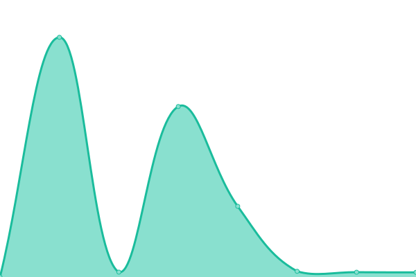

# [📈 Live Status](https://lubosm.github.io/minedusk-uptime/): <!--live status--> **🟧 Partial outage**

<!--start: status pages-->
<!-- This summary is generated by Upptime (https://github.com/upptime/upptime) -->
<!-- Do not edit this manually, your changes will be overwritten -->
<!-- prettier-ignore -->
| URL | Status | History | Response Time | Uptime |
| --- | ------ | ------- | ------------- | ------ |
|  [Ministerstvo školstva, vedy, výskumu a športu Slovenskej republiky](https://www.minedu.sk/) | 🟩 Up | [ministerstvo-skolstva-vedy-vyskumu-a-sportu-slovenskej-republiky.yml](https://github.com/lubosm/minedusk-uptime/commits/HEAD/history/ministerstvo-skolstva-vedy-vyskumu-a-sportu-slovenskej-republiky.yml) | 

 914ms
     
 | 

<a href="https://lubosm.github.io/minedusk-uptime/history/ministerstvo-skolstva-vedy-vyskumu-a-sportu-slovenskej-republiky">100.00%</a>
    

|  [Školský šport](https://skolskysport.sk/) | 🟩 Up | [skolsky-sport.yml](https://github.com/lubosm/minedusk-uptime/commits/HEAD/history/skolsky-sport.yml) | 

 2267ms
     
 | 

<a href="https://lubosm.github.io/minedusk-uptime/history/skolsky-sport">100.00%</a>
    

|  [Centrálny informačný portál pre výskum, vývoj a inovácie](https://www.vedatechnika.sk/) | 🟩 Up | [centralny-informacny-portal-pre-vyskum-vyvoj-a-inovacie.yml](https://github.com/lubosm/minedusk-uptime/commits/HEAD/history/centralny-informacny-portal-pre-vyskum-vyvoj-a-inovacie.yml) | 

 3038ms
     
 | 

<a href="https://lubosm.github.io/minedusk-uptime/history/centralny-informacny-portal-pre-vyskum-vyvoj-a-inovacie">100.00%</a>
    

|  [Edičný portál](https://edicnyportal.iedu.sk/) | 🟩 Up | [edicny-portal.yml](https://github.com/lubosm/minedusk-uptime/commits/HEAD/history/edicny-portal.yml) | 

 6906ms
     
 | 

<a href="https://lubosm.github.io/minedusk-uptime/history/edicny-portal">100.00%</a>
    

|  [eTwinning](http://www.etwinning.sk/) | 🟩 Up | [e-twinning.yml](https://github.com/lubosm/minedusk-uptime/commits/HEAD/history/e-twinning.yml) | 

 595ms
     
 | 

<a href="https://lubosm.github.io/minedusk-uptime/history/e-twinning">100.00%</a>
    

|  [Výskumný ústav detskej psychológie a patopsychológie](https://vudpap.sk/) | 🟩 Up | [vyskumny-ustav-detskej-psychologie-a-patopsychologie.yml](https://github.com/lubosm/minedusk-uptime/commits/HEAD/history/vyskumny-ustav-detskej-psychologie-a-patopsychologie.yml) | 

 3717ms
     
 | 

<a href="https://lubosm.github.io/minedusk-uptime/history/vyskumny-ustav-detskej-psychologie-a-patopsychologie">100.00%</a>
    

|  [IUVENTA](https://www.iuventa.sk/) | 🟩 Up | [iuventa.yml](https://github.com/lubosm/minedusk-uptime/commits/HEAD/history/iuventa.yml) | 

 3196ms
     
 | 

<a href="https://lubosm.github.io/minedusk-uptime/history/iuventa">100.00%</a>
    

|  [Domov Speváckeho zboru slovenských učiteľov](https://www.dszsu.sk/) | 🟩 Up | [domov-spevackeho-zboru-slovenskych-ucitelov.yml](https://github.com/lubosm/minedusk-uptime/commits/HEAD/history/domov-spevackeho-zboru-slovenskych-ucitelov.yml) | 

 2730ms
     
 | 

<a href="https://lubosm.github.io/minedusk-uptime/history/domov-spevackeho-zboru-slovenskych-ucitelov">100.00%</a>
    

|  [Národné športové centrum](https://narodnesportovecentrum.sk/) | 🟩 Up | [narodne-sportove-centrum.yml](https://github.com/lubosm/minedusk-uptime/commits/HEAD/history/narodne-sportove-centrum.yml) | 

 268ms
     
 | 

<a href="https://lubosm.github.io/minedusk-uptime/history/narodne-sportove-centrum">100.00%</a>
    

|  [Centrum vedecko-technických informácií SR](https://www.cvtisr.sk/) | 🟩 Up | [centrum-vedecko-technickych-informacii-sr.yml](https://github.com/lubosm/minedusk-uptime/commits/HEAD/history/centrum-vedecko-technickych-informacii-sr.yml) | 

 3073ms
     
 | 

<a href="https://lubosm.github.io/minedusk-uptime/history/centrum-vedecko-technickych-informacii-sr">100.00%</a>
    

|  [Antidopingová agentúra SR](https://www.antidoping.sk/) | 🟩 Up | [antidopingova-agentura-sr.yml](https://github.com/lubosm/minedusk-uptime/commits/HEAD/history/antidopingova-agentura-sr.yml) | 

 1280ms
     
 | 

<a href="https://lubosm.github.io/minedusk-uptime/history/antidopingova-agentura-sr">100.00%</a>
    

|  [Štátny pedagogický ústav](https://www.statpedu.sk/) | 🟩 Up | [statny-pedagogicky-ustav.yml](https://github.com/lubosm/minedusk-uptime/commits/HEAD/history/statny-pedagogicky-ustav.yml) | 

 2096ms
     
 | 

<a href="https://lubosm.github.io/minedusk-uptime/history/statny-pedagogicky-ustav">100.00%</a>
    

|  [Štátny inštitút odborného vzdelávania](https://siov.sk/) | 🟩 Up | [statny-institut-odborneho-vzdelavania.yml](https://github.com/lubosm/minedusk-uptime/commits/HEAD/history/statny-institut-odborneho-vzdelavania.yml) | 

 2214ms
     
 | 

<a href="https://lubosm.github.io/minedusk-uptime/history/statny-institut-odborneho-vzdelavania">100.00%</a>
    

|  [Štátna školská inšpekcia](https://www.ssi.sk/) | 🟩 Up | [statna-skolska-inspekcia.yml](https://github.com/lubosm/minedusk-uptime/commits/HEAD/history/statna-skolska-inspekcia.yml) | 

 1483ms
     
 | 

<a href="https://lubosm.github.io/minedusk-uptime/history/statna-skolska-inspekcia">100.00%</a>
    

|  [Slovenský historický ústav v Ríme](http://www.shur.sk/) | 🟩 Up | [slovensky-historicky-ustav-v-rime.yml](https://github.com/lubosm/minedusk-uptime/commits/HEAD/history/slovensky-historicky-ustav-v-rime.yml) | 

 695ms
     
 | 

<a href="https://lubosm.github.io/minedusk-uptime/history/slovensky-historicky-ustav-v-rime">100.00%</a>
    

|  [Národný ústav certifikovaných meraní vzdelávania](https://www.nucem.sk/) | 🟥 Down | [narodny-ustav-certifikovanych-merani-vzdelavania.yml](https://github.com/lubosm/minedusk-uptime/commits/HEAD/history/narodny-ustav-certifikovanych-merani-vzdelavania.yml) | 

 0ms
     
 | 

<a href="https://lubosm.github.io/minedusk-uptime/history/narodny-ustav-certifikovanych-merani-vzdelavania">0.00%</a>
    

|  [Metodicko-pedagogické centrum](https://mpc-edu.sk/) | 🟩 Up | [metodicko-pedagogicke-centrum.yml](https://github.com/lubosm/minedusk-uptime/commits/HEAD/history/metodicko-pedagogicke-centrum.yml) | 

 2083ms
     
 | 

<a href="https://lubosm.github.io/minedusk-uptime/history/metodicko-pedagogicke-centrum">100.00%</a>
    

|  [Výskumná agentúra](http://www.vyskumnaagentura.sk/sk/) | 🟩 Up | [vyskumna-agentura.yml](https://github.com/lubosm/minedusk-uptime/commits/HEAD/history/vyskumna-agentura.yml) | 

 1356ms
     
 | 

<a href="https://lubosm.github.io/minedusk-uptime/history/vyskumna-agentura">100.00%</a>
    

|  [Agentúra na podporu výskumu a vývoja](https://www.apvv.sk/) | 🟩 Up | [agentura-na-podporu-vyskumu-a-vyvoja.yml](https://github.com/lubosm/minedusk-uptime/commits/HEAD/history/agentura-na-podporu-vyskumu-a-vyvoja.yml) | 

 1056ms
     
 | 

<a href="https://lubosm.github.io/minedusk-uptime/history/agentura-na-podporu-vyskumu-a-vyvoja">100.00%</a>
    

|  [Centrálne úložisko digitálneho edukačného obsahu](https://viki.iedu.sk) | 🟩 Up | [centralne-ulozisko-digitalneho-edukacneho-obsahu.yml](https://github.com/lubosm/minedusk-uptime/commits/HEAD/history/centralne-ulozisko-digitalneho-edukacneho-obsahu.yml) | 

 995ms
     
 | 

<a href="https://lubosm.github.io/minedusk-uptime/history/centralne-ulozisko-digitalneho-edukacneho-obsahu">100.00%</a>
    

<!--end: status pages-->

[**Visit our status website →**](https://lubosm.github.io/minedusk-uptime/)

## Activity

## 📄 License

- Powered by: [Upptime](https://github.com/upptime/upptime)
- Code: [MIT](./LICENSE) © [Upptime](https://upptime.js.org)
- Data in the `./history` directory: [Open Database License](https://opendatacommons.org/licenses/odbl/1-0/)
